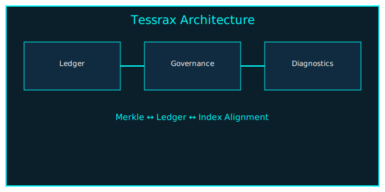

# Proceduralist


---

## ⚙️ **What is Proceduralist?**

**Proceduralist** is a hardened, self-auditing governance engine that merges:

- a **Merkle‑verified append‑only ledger**,  
- a **policy‑driven governance kernel**,  
- a **cryptographically signed memory engine**,  
- and a **diagnostics toolkit** for structural integrity, drift, and replay attacks.

It provides **deterministic, reproducible receipts** for every agent action — forming the backbone of an auditable AI governance stack.

Proceduralist is the “trust substrate” beneath Tessrax.

---

## 📐 **Architecture Overview**

```
core/
 ├── memory_engine.py        → Ed25519 ledger writer + Merkle state
 ├── governance_kernel.py    → Contradiction classifier + severity engine
 ├── models.py               → Receipt validation models
 ├── time.py                 → Canonical UTC time helpers
 └── typecheck.py            → FrozenPayload type verification

governance/
 ├── policy_registry.py      → Policy versioning + rollback
 ├── token_guard.py          → Anti‑replay governance token validator
 └── explorer.py             → Governance summaries

ledger/
 ├── merkle.py               → Merkle accumulator + hash verification
 ├── index_backend.py        → SQLite / RocksDB index backend
 ├── epochal.py              → Epoch manager + snapshot exporter
 ├── auto_repair.py          → Ledger/index repair engine
 ├── parallel_replay.py      → Multithreaded Merkle replay
 ├── compaction.py           → Retention + sharding
 ├── stress_harness.py       → High‑volume synthetic ledger generator
 ├── receipt_diff.py         → Semantic diff
 └── verify_ledger.py        → Full verification suite

cli/
 └── tessraxctl.py           → Governance & diagnostics command tool

docs/
 └── architecture.svg         → Auto‑generated architecture diagram
```

---

## 🧩 **Architecture Diagram**



Proceduralist exposes a unified contract:

- **Every event is signed.**
- **Every event is hashed.**
- **Every event is Merkle‑committed.**
- **Every event is index‑aligned.**
- **Every event is auditable.**

No silent writes. No drift. No ambiguity.

---

## 🛠️ Installation

```bash
git clone https://github.com/joshuavetos/Proceduralist
cd Proceduralist
pip install -r requirements.txt
```

Ensure you have:

- Python 3.11+
- `pynacl`
- SQLite 3.34+
- Governance token exported:

```bash
export TESSRAX_GOVERNANCE_TOKEN="your-approval-token"
```

---

## 🚀 CLI Usage (`tessraxctl`)

Proceduralist includes a full governance and diagnostics CLI.

### **List of commands**

```bash
tessraxctl auto-repair
tessraxctl auto-diagnose
tessraxctl rebuild-index
tessraxctl diff-receipts <left.json> <right.json>
tessraxctl explore-governance
tessraxctl stress-harness <output.jsonl> --entries 10000
tessraxctl export-architecture <output.svg>
tessraxctl export-merkle-svg <output.svg>
```

### Example:

```bash
tessraxctl auto-diagnose
```

Produces:

- Merkle root verification  
- Index alignment & hash diff  
- automatic repair suggestions  
- persisted diagnostic report  

---

## 🔐 Governance Token Model

Proceduralist introduces **anti-replay token freshness**:

- Requires `TESSRAX_GOVERNANCE_TOKEN`
- Tokens expire on inactivity
- Tokens cannot be reused across ledger events
- Full state persisted in `token_state.json`

If replay or expiration is detected, all writes halt with:

```
GovernanceTokenError
```

---

## 🔑 Key Rotation Model

Keys rotate via:

```
rotate_key(reason="…", governance_token="…")
```

Each rotation generates:

- cross‑signed proof (old key → new key, new key → old key)  
- rotation receipts  
- rotation policy snapshot  
- enforcement of multi‑approver requirements  

All stored in:

```
tessrax/infra/signing_keys/
```

---

## 🧪 Running Tests

Proceduralist includes a full upgrade suite:

```bash
pytest -q
```

Includes tests for:

- Merkle replay  
- Epoch assignments  
- Key rotation  
- Governance tokens  
- Auto-diagnostics  
- Index backends  
- CLI integration  
- Stress harness  

---

## 🧭 Project Philosophy

Proceduralist exists to enforce:

- **Determinism** over probability  
- **Receipts** over trust  
- **Governance** over vibes  
- **Verification** over plausibility  
- **Irreversibility** over hidden state  

It is designed for environments that cannot afford hallucinated state or silent corruption.

---

## 📌 Roadmap

- [ ] Full web-based governance explorer  
- [ ] Block-level Merkle replay visualizer  
- [ ] Real-time event streaming API  
- [ ] Multi-key quorum signatures  
- [ ] Encrypted off-device snapshots  
- [ ] WASM runtime for lightweight agents  

---

## 🛡 Security Notes

- Never commit private keys to version control.
- Always rotate keys after sensitive deployments.
- Keep governance tokens ephemeral.
- Ledger writes MUST be on a trusted host.
- Do not disable Merkle verification unless in offline recovery.

---

## 📄 License

MIT — free to modify, fork, reuse.

---

## ⭐ Contribute

Issues and PRs welcome.  

If you build tooling on top of Proceduralist, tag the repo — the ecosystem grows stronger with each extension.

---

**Proceduralist — deterministic governance for uncertain systems.**
